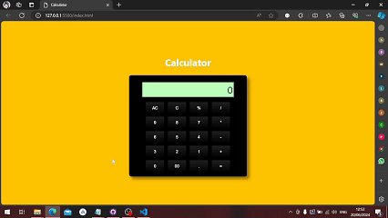

# TASK 2
### Building a Calculator, via HTML,CSS, JS
Develop a Calculator app that performs basic math operations Interns will create a web-based calculator application using HTML,CSS, and Javascript to Perform arithmetic Calculations such as addition, subtraction, mutiplication,and division

