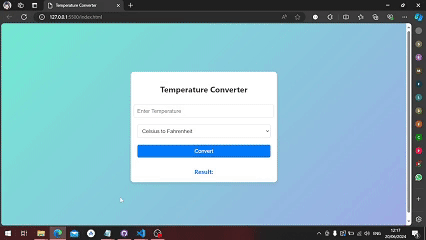

# TASK 3 

Develop a temperature converter app. Interns will desgin and build a webbased temperature convertor application using HTML, CSS, and JavaScript, enabling users to convert tempraturess between celsius Fahernheit, and Kelvin

